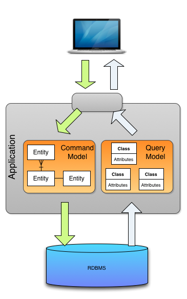
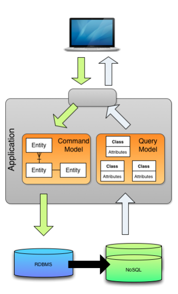
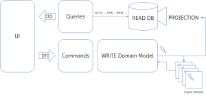

# CQRS (Command and Query Responsibility Segregation)
네이밍 그대로 명령과 쿼리의 역할을 구분하는 것이다. (CUD / R)

전통적 CRUD 아키텍처 기반에서 앱을 개발 및 운영하면 자연스레 도메인 복잡도가 증가하며,

이로 인해 유지보수 비용이 증가할 뿐 아니라 도메인 설계 시 의도한 방향과는 다르게 변할 수 있다.

# HOW?

1. RDBMS를 분리하지 않고 Model 계층 부분만 Command와 Query 모델로 분리하는 수준.

이렇게 모델을 분리함으로써 각자의 도메인 계층만 모델링 및 코딩하기에 보다 단순하게 구현할 수 있다.

하지만 동일 DB를 사용함에 따라 성능 이슈를 개선하진 못한다.

2. Broker를 통해 서로 다른 노드를 동기화 처리 하는 방식.

Command / Query의 DB를 분리하고 별도의 브로커를 통해 이 둘간의 데이터를 동기화 하는 방식.

각 도메인들은 자신의 시스템에 맞는 DB를 선택하여 폴리글랏 저장구조로 구성할 수 있다.

다만 Broker의 가용성과 신뢰도가 보장되어야 한다는 Risk가 존재한다.

3. 이벤트소싱 모델

앱 내 모든 상태를 이벤트로 전환해 이벤트 스트림을 별도의 저장소에 저장하는 방식이다.

이벤트 스트림을 저장하는 저장소는 오직 데이터의 추가만 가능하며, 이렇게 추가된 데이터를 구체화 시키는 시점에 조회 대상 데이터를 작성한다.

# Ref
- https://www.popit.kr/cqrs-eventsourcing/